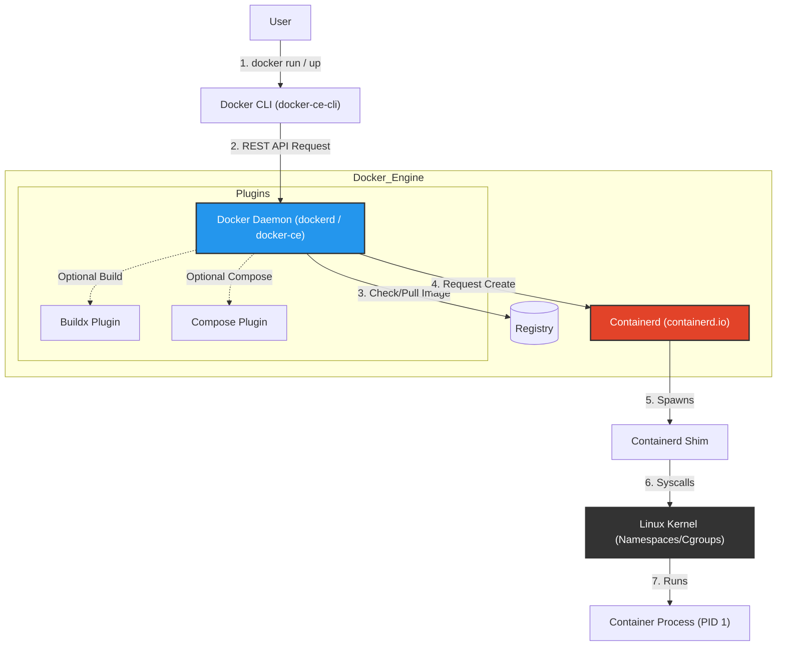
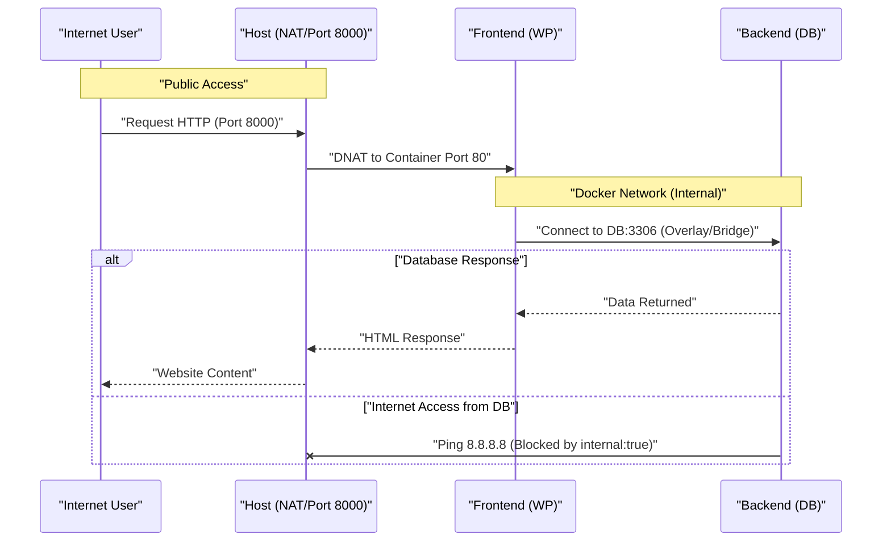
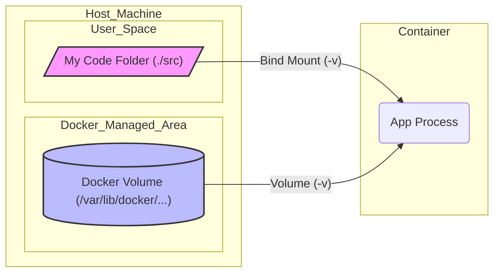

```mermaid
graph TD
    User["User"] -->|"1. docker run / up"| CLI["Docker CLI (docker-ce-cli)"]
    CLI -->|"2. REST API Request"| Daemon["Docker Daemon (dockerd / docker-ce)"]
    
    subgraph Docker_Engine
        Daemon -->|"3. Check/Pull Image"| ImageRegistry[("Registry")]
        Daemon -->|"4. Request Create"| Containerd["Containerd (containerd.io)"]
        
        subgraph Plugins
            Daemon -.->|"Optional Build"| Buildx["Buildx Plugin"]
            Daemon -.->|"Optional Compose"| Compose["Compose Plugin"]
        end
    end
    
    Containerd -->|"5. Spawns"| Shim["Containerd Shim"]
    Shim -->|"6. Syscalls"| Kernel["Linux Kernel (Namespaces/Cgroups)"]
    Kernel -->|"7. Runs"| Process["Container Process (PID 1)"]

    style Daemon fill:#2496ed,stroke:#333,stroke-width:2px,color:white
    style Containerd fill:#e24329,stroke:#333,stroke-width:2px,color:white
    style Kernel fill:#333,stroke:#333,stroke-width:2px,color:white
```

```mermaid
sequenceDiagram
    participant User as "Internet User"
    participant Host as "Host (NAT/Port 8000)"
    participant Front as "Frontend (WP)"
    participant Back as "Backend (DB)"

    Note over User, Host: "Public Access"
    User->>Host: "Request HTTP (Port 8000)"
    Host->>Front: "DNAT to Container Port 80"
    
    Note over Front, Back: "Docker Network (Internal)"
    Front->>Back: "Connect to DB:3306 (Overlay/Bridge)"
    
    alt "Database Response"
        Back-->>Front: "Data Returned"
        Front-->>Host: "HTML Response"
        Host-->>User: "Website Content"
    else "Internet Access from DB"
        Back-xHost: "Ping 8.8.8.8 (Blocked by internal:true)"
    end
```

```mermaid
graph LR
    subgraph Host_Machine
        subgraph User_Space
            CodeFolder[/"My Code Folder (./src)"/]
        end
        
        subgraph Docker_Managed_Area
            %% Chỗ này phải bọc ngoặc kép vì có dấu ngoặc đơn lồng nhau
            VolumeBucket[("Docker Volume (/var/lib/docker/...)")]
        end
    end

    subgraph Container
        AppProcess("App Process")
    end

    %% Bọc ngoặc kép cho text trên mũi tên
    CodeFolder -->|"Bind Mount (-v)"| AppProcess
    VolumeBucket -->|"Volume (-v)"| AppProcess

    classDef dev fill:#f9f,stroke:#333,stroke-width:2px;
    classDef prod fill:#bbf,stroke:#333,stroke-width:2px;
    
    class CodeFolder dev;
    class VolumeBucket prod;
```

